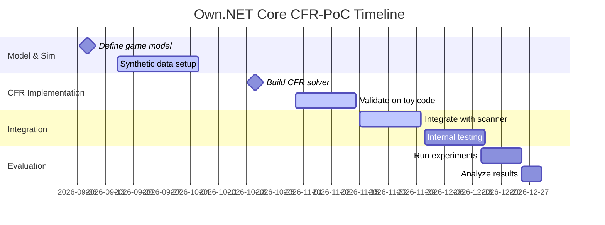
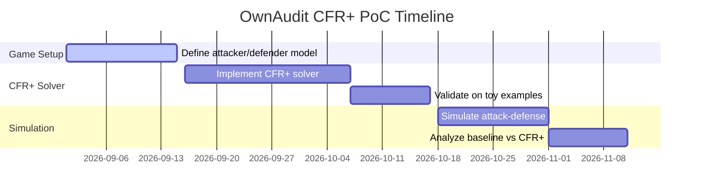

# Integrating Game-Theoretic Adversarial Methods into Own.NET Projects

**Executive Summary:** We analyze how Counterfactual Regret Minimization (CFR) and related adversarial decision frameworks can be adapted to each project. For **Own.NET Core**, we propose using CFR to prioritize and schedule static analysis under uncertainty (treating code context as hidden information). For **007/OwnAudit**, we model attacker–defender interactions (vulnerability injection vs. audit actions) as a sequential game solved by CFR/CFR+. For **Agent Review Policies**, we consider multi-agent/regret-learning to optimize review strategies over time. For **Graph/State-Drift Detection**, we view drift as an adversarial change-detection game (agent vs. hidden system changes). Each section below includes a project-specific proposal with model details, a Proof-of-Concept (PoC) plan (milestones, data, compute, timeline, metrics), risks, integration points (with .NET/F# stacks), and evaluation criteria. We also compare alternatives (MCCFR, regret-matching bandits, multi-armed bandits, reinforcement learning, Bayesian decision theory) in a summary table. Key sources (seminal CFR papers, ArXiv work, and related tools) are cited throughout.

## Background: CFR and Related Techniques

Counterfactual Regret Minimization (CFR) is an iterative algorithm for solving **extensive-form games** with imperfect information. In these games, players make sequential decisions without full state knowledge, so states are partitioned into *information sets* (all states indistinguishable to a player). CFR minimizes *counterfactual regret* at each information set (via regret-matching), guaranteeing convergence to a Nash equilibrium in two-player zero-sum games.  For large games, extensions like **MCCFR** use Monte Carlo sampling to reduce computation, and **CFR+** (used by best poker bots) speeds convergence by resetting negative regrets to zero. For extremely large or continuous domains, **Deep CFR** trains neural nets to approximate CFR strategies, obviating manual abstraction.  

Other adversarial decision methods include **regret-matching bandits** (adapted bandit algorithms that mimic regret updates) and classical **multi-armed bandits** for exploration–exploitation trade-offs. *Reinforcement Learning (RL)* places a single agent in an environment to maximize cumulative reward via trial-and-error. *Bayesian decision theory* uses probability models to maximize expected utility under uncertainty. Table 2 (below) summarizes these approaches. 

Throughout, we cite primary sources and seminal work: Zinkevich *et al.* on CFR, Lanctot *et al.* on MCCFR, Johanson *et al.* on CFR+, and Brown *et al.* on Deep CFR. We also reference security-game adaptations of CFR to motivate applications to auditing and detection.

## 1. Own.NET Core

### Executive Summary  
Own.NET Core is a static analysis engine. We propose augmenting it with game-theoretic decision logic to **prioritize analyses under uncertainty**. Treating hidden or uncertain program context as an “adversary,” CFR can compute a mixed strategy over analysis actions (e.g. which rules or data-flow checks to apply) that minimizes regret (missed bugs) while accounting for analysis cost.

### Concrete Proposal (Scope, Objectives, Benefits)  
- **Scope:** Integrate a “CFR-driven analysis scheduler” module. It iteratively learns which analysis routines to apply under which code conditions. For example, when scanning code changes, the module chooses between lightweight (fast) rules vs. deep (slow) analyses based on probabilistic beliefs about latent bugs.  
- **Objectives:** (1) *Adaptive prioritization* – focus analysis where bugs likely exist. (2) *Cost/regret trade-off* – balance thoroughness against runtime. (3) *Robustness to hidden context* – handle unknown runtime paths or configurations as “hidden information.”  
- **Expected Benefits:** More efficient bug detection (higher recall for given CPU budget), reduced false positives by focusing resources, and demonstration of principled, self-improving analysis strategies.

### Technical Design  
- **Players:** 
  - *Defender (Analyzer Agent):* selects analysis actions (e.g. run static checker A, B, or skip). 
  - *Nature/Env (Adversary):* determines the hidden bug or context (e.g. actual vulnerability type present, dynamic behaviors). This models unknown runtime behavior or unobserved code invariants.  
- **Information Sets / Observations:** The analyzer sees only static features (file type, code complexity metrics, recent code changes) – analogous to an “information set”. The adversary’s “state” (which bugs exist or how the code will execute) is hidden.  
- **Actions:** At each decision point (e.g. inspecting a function or commit), the defender picks an analysis action: *skip* (do nothing), *light-check* (linters, quick parse), *deep-check* (data-flow analysis), *dynamic test generation*, etc.  
- **Utility (Rewards):** The defender’s payoff is +1 for each vulnerability correctly identified (or potential bug averted), minus a cost for each analysis action (CPU time, false positive penalty). The adversary’s payoff is opposite (finding untrapped bugs). This is essentially a zero-sum regret minimization.  
- **Simulation Method:** Build a simulated environment of code modules with seeded bugs (or use historical bug data). Self-play: repeatedly simulate “analyzer vs. code” episodes, updating CFR regrets at each info set (code context) to learn the mixed strategy. Outcome sampling (MCCFR) can be used for scalability. For example, if code has a 70% chance of containing bug type X unseen to the analyzer, CFR will gradually learn to run heavy analysis when X-likely patterns appear.  

### Prioritized PoC Plan  
- **Milestones:** 
  1. *Game Model & Simulator* (1 month): Define simplified code “game” (features, bug distributions) and baseline utilities.  
  2. *CFR Engine Implementation* (2 months): Implement (in F#/.NET) a CFR solver for the model, possibly reusing BrianBerns’s F# code for reference.  
  3. *Integration with Own.NET* (2 months): Hook the CFR module into the analysis pipeline (deciding checks on real code samples).  
  4. *Evaluation* (1 month): Measure gains on held-out code (bug detection rate vs. CPU cost).  
- **Dataset:** Start with a small corpus of annotated .NET code (e.g. vulnerabilities from past audits or synthetic bugs). This serves as “game states.”  
- **Compute:** A standard server (8–16 CPU cores) should suffice for prototype. CFR simulations are parallelizable (see BrianBerns repo on parallelization).  
- **Timeline:** ~6 months total. See Gantt chart below for key phases.  

- **Success Metrics:** Compare against baseline static analysis (e.g. pure rule-based). Metrics include *bug recall* (fraction of known bugs found), *analysis cost* (CPU time), and *regret* (difference between chosen strategy and best fixed strategy in hindsight). Improvement might be measured by higher recall at equal cost or lower cost for same detection rate.  

### Risks and Limitations  
- **Model Simplification:** The game may oversimplify actual code complexity. Real code “states” are huge; we assume independent modules or pattern features. If the CFR model omits key code interactions, the strategy may be suboptimal.  
- **Convergence & Scalability:** CFR guarantees apply to two-player zero-sum games with finite info sets. Real code analysis may not be strictly zero-sum or two-player. In non-zero-sum or multi-player scenarios (e.g. multiple analyzers), we might need more advanced equilibria notions.  
- **Overfitting to Simulated Data:** If using synthetic bugs, the CFR strategy might not generalize. Mitigation: use real audit logs if available, or vary patterns during training.  
- **Complexity:** CFR requires iterating over many possible game histories. For large codebases, state/action spaces grow. We assume manageability via coarse abstraction (e.g. cluster similar modules).

*Assumptions:* We assume the ability to simulate bug injection and that a coarse information set (e.g. by file or class) suffices. We assume static analysis actions have quantifiable cost and that defender/adversary utilities can be approximated (e.g. giving equal weight to each bug).

### Integration Points  
- **Language & Libraries:** Implement the CFR logic in F# or C# as part of the Own.NET codebase. F# can interoperate with existing C# libraries for static analysis (Roslyn analyzers).  
- **Services/Pipelines:** The CFR module could be an independent service or microservice that receives code features (via JSON) and returns action probabilities. It fits into the current pipeline by deciding which analyzers to run on each code piece.  
- **Data Inputs:** Feature data (code metrics, recent change flags) is already available in the analysis pipeline; CFR module subscribes to that stream.  
- **Parallelism:** CFR training is parallelizable per information set; we can leverage .NET parallel libraries (Tasks, TPL) or Azure Batch for heavy compute.  
- **Persistence:** Learned strategy (probability tables per info set) can be stored (e.g. in a SQL/NoSQL store) and updated over time.

### Recommended Evaluation Metrics  
- **Detection Recall/Precision:** Fraction of known vulnerabilities found (and false positives) versus baseline.  
- **Resource Efficiency:** Analysis CPU-time saved or throughput increased.  
- **Regret:** Average regret per decision (should go toward 0 if learning).  
- **Robustness:** Performance on out-of-sample code changes (resilience to code drift).  

## 2. 007/OwnAudit (Adversarial Audit Scheduling)

### Executive Summary  
For the OwnAudit security audit pipeline, we cast it as a **sequential security game**: the defender (auditor) allocates limited auditing resources against an attacker who may exploit hidden vulnerabilities. Using CFR/CFR+ (as in recent security-game research), we compute mixed strategies for resource allocation that minimize worst-case loss.

### Concrete Proposal (Scope, Objectives, Benefits)  
- **Scope:** Develop a “game-theoretic prioritization engine” within OwnAudit. It will model attacker types (bug categories) as hidden states and decide on audit actions (which tests or tools to apply) to maximize vulnerability discovery under budget constraints.  
- **Objectives:** (1) *Dynamic prioritization* – adapt audit intensity by context. (2) *Robust coverage* – cover diverse attacker strategies (e.g. injection, leak, auth). (3) *Efficiency* – use game equilibrium to avoid predictable patterns.  
- **Expected Benefits:** Reduced risk of missed critical vulnerabilities, more defensible audit decisions (provably optimal against worst-case attacker), and data-driven justification for resource allocation (e.g. “statistically, focusing on rule X yields the lowest regret”).

### Technical Design  
- **Players:** 
  - *Attacker:* selects a vulnerability exploitation strategy (e.g. injection, auth bypass, data exfiltration). The attacker’s type is hidden (imperfect information).  
  - *Defender (Auditor):* chooses audit actions under budget (e.g. perform static analysis, run a penetration test, or skip).  
- **Information Sets:** The attacker knows which code or system component is being audited and their hidden type. The auditor sees features (code history, team change logs) but not the attacker’s exact payload. These form imperfect-information sets for each player.  
- **Actions:** 
  - Attacker actions: *choose an attack vector* or *target component* at each turn.  
  - Auditor actions: *select audit modality* (static scan, dynamic analysis, pen-test) or *prioritize component*. Could include “no action” if budget is exceeded.  
- **Utility:** Assign positive reward if an attack is detected/blocked, negative for successful exploits and audit costs. For example, +R for finding a critical bug, –C for audit effort, –P if a breach occurs undetected. Zero-sum or near-zero-sum can be assumed (attacker’s gain is auditor’s loss).  
- **Simulation Method:** This is akin to a *sequential security game with chance nodes*. We can adapt frameworks like those in [8]. For PoC, start with a discrete abstraction: suppose there are 3 attacker types and 3 audit tools. Build an extensive-form game graph (turns: attacker picks type, defender picks tool, chance reveals result). Use **CFR+** (which efficiently handles imperfect recall) to solve for a mixed strategy equilibrium. The equilibrium strategy tells the auditor how often to use each tool given context.   

### Prioritized PoC Plan  
- **Milestones:** 
  1. *Game Definition* (2 weeks): Formalize attacker types, defender actions, information sets (based on code metadata). Define payoff matrix.  
  2. *CFR+ Solver* (4 weeks): Implement (or use an open CFR library) a sequential game solver (based on existing CFR+ code). 
  3. *Simulation Environment* (3 weeks): Generate synthetic “audit scenarios” (random code with hidden bugs) to simulate attacker/defender interactions.  
  4. *Strategy Testing* (3 weeks): Evaluate defender strategy effectiveness against baseline heuristics (e.g. always static scan first).  
  5. *Integration Prototype* (4 weeks): Connect solver to OwnAudit pipeline: when new code arrives, the CFR module suggests audit actions per its strategy.  
  6. *Feedback Loop & Update* (ongoing): Update the game model with real audit results over time.  
- **Data Requirements:** Start with a minimal dataset of past audit results (if any) or curated vulnerability stories. The PoC can use synthetic data (code segments with labeled bug types) to train the model. Over time, real audit logs and scanner outputs can refine probabilities (Bayesian updating of attacker type priors).  
- **Compute:** CFR+ is efficient and often faster than LP-based security game solvers. A multi-core server (8–16 cores) should suffice, as CFR+ can be parallelized per information set.  
- **Timeline:** ~4–5 months. A Gantt excerpt for early phases:

- **Success Metrics:** Key metrics include *fraction of vulnerabilities detected* and *expected utility*. For example, measure the defender’s cumulative payoff under the CFR+ strategy versus a baseline (greedy or fixed). A lower exploit success rate or higher Nash payoff indicates success. We can also track *exploit regret* (how much worse our strategy is vs. the clairvoyant optimum).

### Risks and Limitations  
- **Model Accuracy:** The abstraction of attacker types may be too coarse. Real attackers evolve; our static type model may quickly become outdated. Mitigation: allow re-training with updated type distributions.  
- **Imperfect Recall Issues:** If defenders forget past actions, the game is imperfect-recall. CFR+ handles some imperfect recall, but guarantees weaken. We assume the state space remains manageable by abstracting (e.g. treat each audit turn independently).  
- **Convergence:** CFR/CFR+ converges to an equilibrium; in practice, auditors may not converge fully in finite time. Use CFR+ current strategy (known to approximate equilibrium quickly).  
- **Single vs. Repeated Interactions:** CFR assumes repeated self-play. Real audit is not repeated games against the same adversary. We assume attacker distribution is stationary; otherwise, a single-shot Stackelberg approach might be needed.  
- **Data Scarcity:** Without actual attack statistics, we must assume priors. CFR assumes worst-case attacker; if reality is easier, CFR strategies may be conservative.

### Integration Points  
- **Stack & Tech:** Implement the solver in .NET/F# or integrate a C++/Rust CFR library via interop (e.g. **Fro116/counterfactual-regret-minimization** is a C++ header-only CFR library). F# can call into such libraries or use `Process` to invoke a separate solver.  
- **Data Pipelines:** The game model needs current system state (e.g. which services are deployed) and audit logs. Existing databases (SQL/NoSQL) of code metrics can feed into attacker type probabilities.  
- **Services:** The audit engine can expose an API: “Given (module X, context Y), return audit action probabilities.” That API can be called by the audit scheduling service.  
- **Incremental Updates:** New threat intel can adjust game payoffs dynamically. For example, an emergent vulnerability raises the prior of that attacker type; the game solver can then be rerun to adapt strategy.  

### Recommended Evaluation Metrics  
- **Detection Rate:** % of high-severity vulnerabilities caught.  
- **False Negative Regret:** Probability weighted by severity of bugs missed.  
- **Cost Efficiency:** Vulnerabilities found per audit-hour.  
- **Strategy Robustness:** Worst-case performance assuming an adversary chooses optimally. We can estimate this via worst-case regret.

## 3. Agent Policy / Review Agents

### Executive Summary  
For autonomous code-review or policy agents (e.g. an AI that suggests fixes or enforces coding policies), we propose using **multi-agent regret learning** or RL to optimize their decisions. If multiple agents (e.g. one per developer team) interact, CFR/MCCFR can compute equilibria. If it’s a single agent, we focus on RL or bandit algorithms.  

### Concrete Proposal  
- **Scope:** Develop an “adversarial learning” framework for review agents. This could involve: (a) treating the agent and an “environment” (unknown bug distribution, or even another agent) as players in a game, or (b) using reinforcement learning to optimize a single agent’s policy over episodes of code review.  
- **Objectives:** (1) *Policy improvement* – learn which review actions (comments, suggestions, tests) most effectively reduce bugs. (2) *Consistency* – ensure the agent’s decisions generalize and adapt to developer behavior. (3) *Scalability* – use lightweight models (bandits) for per-PR tweaks, or heavier RL for long-term strategy.  
- **Benefits:** Over time, the agent should focus on the most impactful review actions (e.g. prioritizing security feedback on high-risk code). It can also adapt to adversarial scenarios (e.g. a developer repeatedly ignoring suggestions).

### Technical Design  
- **Scenario A: Multi-Agent Game:** If multiple review agents or developer “types” exist, we can model them as players in an extensive-form game. For example, *Agent* vs. *Adversarial Developer*: the agent chooses a suggestion style, the developer “acts” by either fixing the issue or introducing bugs. CFR could be used to find robust advising strategies. However, concrete formalization is complex and may go beyond immediate PoC.  
- **Scenario B: Single-Agent RL:** More tractable is RL for the agent. States = code context + review history; actions = {comment on X, suggest test Y, approve, request changes}. Rewards = positive if bugs prevented or caught, negative if bug slipped through. This is a (possibly POMDP) problem. A policy-gradient or Q-learning agent could learn over many review episodes.  
- **Regret/Bandit Approach:** In simpler cases (e.g. binary choice: “should I point out this lint warning or ignore it?”), one can use *multi-armed bandits with context*. The contexts are code snippet features; arms are possible comments. A Thompson Sampling or UCB approach can learn which comments yield high reward (issue fixed) without modeling a full game.  

### Prioritized PoC Plan  
- **Milestones:** 
  1. *Define Task & Metrics* (1 week): e.g. agent must flag security issues in code review.  
  2. *Dataset Collection* (2 weeks): Compile past code reviews, labeled where suggestions caught bugs vs. ignored.  
  3. *Policy Baseline* (3 weeks): Implement simple rules (e.g. always comment on all flagged issues).  
  4. *Bandit Prototype* (4 weeks): Treat each suggestion type as an arm. Run contextual bandit (e.g. LinUCB) on past reviews to estimate effectiveness.  
  5. *RL Prototype* (6 weeks): If data allows, train a basic RL agent (e.g. DQN) to maximize future bug prevention.  
  6. *Evaluation* (3 weeks): Compare agent against baseline on a hold-out set (new PRs).  
- **Data:** Historical code review transcripts (e.g. GitHub PR comments) with outcomes (whether an issue was later fixed or led to a bug report). For context features: code complexity, file path, security labels.  
- **Compute:** The bandit approach is lightweight (runs in-memory). RL training may need GPU if deep nets used, but a simple environment (small code features) could use CPU RL (e.g. ML.NET or Accord.NET).  
- **Timeline:** ~4 months. We may run bandits and RL in parallel.  

- **Success Metrics:** 
  - *Per-episode Reward:* e.g. % of bugs caught per review session.  
  - *Average Reward:* learning curve of reward vs. time (should increase).  
  - *Human Override Rate:* measure how often developers accept agent’s suggestions (higher is better if false positive low).  
  - *Regret:* If framed as bandit, track cumulative regret.

### Risks and Limitations  
- **Sparse Feedback:** In reviews, rewards (bug prevents) are sparse and delayed. Bandits assume immediate reward (not always true). This may degrade learning.  
- **State Explosion:** An RL state (entire code context) is huge. We may only use summary features, which can miss details.  
- **Adversarial Developers:** If developers learn agent’s strategy (or game becomes non-cooperative), simple RL may not capture this. A full game-theoretic model might be needed.  
- **Evaluation Noise:** It’s hard to measure an agent’s impact conclusively (many confounding factors). Expect incremental gains.  

### Integration Points  
- **.NET Libraries:** Use ML.NET (for bandits/RL) or integrate Python ML via a microservice. F# can call ML.NET or external API.  
- **Services:** This could be a component in the code review pipeline (e.g. GitHub webhook triggers to ML service that suggests comments).  
- **Data Pipeline:** Pull review logs from Git (existing), update the model online or nightly.  
- **Continuous Learning:** Deployed agent can gather feedback (accepted/rejected suggestions) to update its strategy (an online bandit or RL update).  

### Recommended Metrics  
- **Mean Reward per Review:** Average bugs prevented or issues resolved per PR review.  
- **Adoption Rate:** Fraction of agent suggestions that devs accept.  
- **Model Regret:** For bandits, cumulative regret over time (should grow sublinearly).  
- **Safety:** Keep false positives (irrelevant comments) below a threshold to avoid dev fatigue.

## 4. Graph/State-Drift Detection

### Executive Summary  
Graph/state-drift detection involves monitoring evolving systems (dependency graphs, config states) and detecting anomalous changes. We propose a **game-theoretic viewpoint**: treat the system as an adversary that may “drift” the state, and a monitoring agent playing a detection strategy. CFR or adversarial bandits can help set thresholds or escalate alerts optimally.

### Concrete Proposal  
- **Scope:** Focus on detecting *adversarial drift* in system graphs (e.g. unauthorized config changes) rather than random drift. The agent decides when and what to monitor.  
- **Objectives:** (1) *Timely detection* of meaningful state changes (e.g. architecture violations). (2) *Minimize false alarms* under uncertainty. (3) *Adversarial robustness* – assume an attacker may try to hide changes.  
- **Benefits:** A learned, adaptive anomaly detection policy could outperform static rules. It might capture subtle “backdoor” drifts by exploring in a pattern that minimizes attacker success probability.

### Technical Design  
- **Players:** 
  - *Adversary (System drift):* chooses hidden state changes (e.g. unauthorized dependency added).  
  - *Defender (Monitor Agent):* chooses monitoring actions (scan logs, query graph metrics, alert or ignore).  
- **Information Sets:** The agent sees only logged observations (e.g. partial graph metrics) – an information set. The adversary’s full change is hidden.  
- **Actions:** 
  - Agent: { “trigger scan of subgraph X”, “increase log level”, “ignore state for now” }.  
  - Adversary: any hidden change to graph (modeled as chance with different probabilities if not adversarial, or adversarial choice if attacker-aware).  
- **Utility:** +1 if a malicious change is detected early, –1 if a change goes undetected (times a severity factor), and –c for each costly monitoring action (compute, false alarm).  
- **Simulation Method:** One can frame this as a **stochastic game**. For PoC, define a small graph domain (e.g. nodes with states) and simulate sequences of benign/drift events. Apply CFR or adversarial bandits: e.g., assume a worst-case drift schedule and compute the agent’s strategy via self-play. In simpler cases, model it as a *POMDP* and solve via approximate methods.  

### Prioritized PoC Plan  
- **Milestones:** 
  1. *Define Graph Domain* (2 weeks): Choose a toy graph (10–20 nodes) and possible drifts (edge additions/removals).  
  2. *Set Up Simulator* (3 weeks): Random and adversarial drift generator, with ground-truth “drift severity.”  
  3. *Simple Detection Baseline* (2 weeks): Rule-based detection (thresholds on metrics).  
  4. *CFR/Bandit Strategy* (4 weeks): Implement a CFR-inspired decision maker or a contextual bandit that chooses which node to inspect.  
  5. *Evaluation* (2 weeks): Test detection speed (time to detect) vs false alarm rate.  
- **Data:** Synthetic time-series graph data with labeled anomalies (drifts). Optionally, use real network config logs (if available) for realism.  
- **Compute:** Very light. This PoC is small-scale; even a laptop suffices. For a more realistic model, a mid-range server for simulation is adequate.  
- **Timeline:** ~3 months.

- **Success Metrics:** 
  - *Detection Delay:* Time from adversarial change to detection.  
  - *False Positive Rate:* Fraction of non-malicious changes that trigger alerts.  
  - *Detection Accuracy:* Fraction of actual drifts caught.  
  - *Expected Utility:* Trade-off metric combining detection rewards and monitoring costs.

### Risks and Limitations  
- **Low Signal:** Graph drifts may be subtle; the information set (observed logs) might not correlate strongly with hidden state. CFR may struggle if utility signals are sparse.  
- **Model Mis-specification:** Our abstract game may not capture real threat models (attackers might behave differently than assumed).  
- **Scalability:** Real systems have large, dynamic graphs. CFR will not scale directly; one must cluster states or use hierarchies. PoC focuses on concept demonstration, not full deployment.  
- **False Alarms:** An overly aggressive learned strategy might generate many alerts. We must tune utilities to penalize false positives heavily.

### Integration Points  
- **Data Pipelines:** Connect to existing monitoring logs (e.g. system event streams). The agent can subscribe to metrics via REST or message queue.  
- **.NET Ecosystem:** Use libraries like QuickGraph or Microsoft.ML for graph analysis. Implement the logic in F#, possibly leveraging Akka.NET for simulation of events.  
- **Services:** The detection module could be a microservice that continuously ingests graph snapshots and recommends alerts. It may also feed a dashboard service for security teams.  
- **Update Mechanism:** If actual drifts occur, update the game model’s prior probabilities or utilities (akin to Bayesian updates).

### Recommended Metrics  
- **True/False Positive Rates:** Standard anomaly detection metrics on drifts.  
- **Mean Time to Detection (MTTD):** How quickly anomalies are caught, ideally minimized.  
- **Cumulative Regret:** If framed as bandits, measure regret in catching anomalies versus an oracle strategy.  
- **Uptime Impact:** Indirect measure – how often critical drifts cause system issues (should decrease under the new strategy).

## 5. Comparison of Methods

| **Method**                 | **Pros**                                                                                           | **Cons**                                                                                         | **Use When…**                                              |
|----------------------------|----------------------------------------------------------------------------------------------------|--------------------------------------------------------------------------------------------------|------------------------------------------------------------|
| **CFR (Counterfactual Regret Minimization)**  | – Handles sequential, imperfect-information games. – Guarantees (approx.) Nash equilibrium in 2-player zero-sum settings. – Well-studied (poker, security games).  | – Computationally heavy for large games (need full game tree or sampling). – Assumes adversarial opponent; not directly for single-agent tasks. | Complex multi-step adversarial scenarios (attacker vs defender). Use when you can model the problem as a 2-player (or multi-player) game with hidden information (e.g. audit allocation, hierarchical decisions). |
| **Monte Carlo CFR (MCCFR)** | – Lower per-iteration cost via sampling. – Empirically converges faster in large games. – Flexible sampling schemes for huge state spaces. | – Requires many iterations (higher variance). – Implementation complexity (sampling schemes, variance reduction). | When the game tree is too large for full traversal but you can sample trajectories (e.g. large poker-like or networked security games).               |
| **Regret-Matching Bandits**   | – Adapts regret-matching ideas to bandit setting (exploration focused). – Often simple to implement (modification of UCB or gradient bandit). | – Less standard term; fewer off-the-shelf tools. – Still assumes adversarial/noisy rewards; may be suboptimal if environment is stochastic not adversarial. | When you need a simple online learning rule that uses regret feedback (e.g. tuning hyperparameters or A/B tests adaptively). |
| **Multi-Armed Bandits**           | – Simple model for exploration vs. exploitation. – Very efficient (few samples). – Many variants (contextual bandits, Thompson Sampling). | – No state transition (static or context only). – Not inherently adversarial (assumes stationary reward distributions). | When decisions are independent and rewards are immediate, e.g. A/B testing, choosing among analytics tools, or routing limited audits between competing tasks.  |
| **Reinforcement Learning**        | – Handles general sequential decision tasks; learns from raw interaction.. – Can incorporate rich state and reward structures. – Mature ecosystem (neural Q-networks, policy gradients). | – Data-hungry (needs many training episodes). – No explicit adversarial opponent (often assumes MDP/predictable env). – Convergence and stability issues in high dimensions. | When modelling as a single-agent MDP/POMDP makes sense (e.g. optimizing a review agent over many PRs) and you have ample simulation or data. Good for complex states with many dynamics. |
| **Bayesian Decision Theory**   | – Explicitly models uncertainty with priors; chooses actions to maximize expected utility. – Can incorporate domain knowledge (priors on vulnerability rates, drift likelihood). | – Typically single-stage decisions or requiring closed-form models; doesn’t handle rich sequential games well without approximations. – Computationally expensive if many hypotheses. | When decisions are one-off or repeated with well-understood probabilistic models (e.g. deciding whether to audit a component given a known bug-rate prior, rather than a complex game). |

Each method has trade-offs. For example, **multi-armed bandits** excel at fast adaptation in a single-phase choice problem (e.g. allocating scan time among independent code modules) because they efficiently balance exploration/exploitation. However, bandits do not model opponent responses. In contrast, **CFR** explicitly models an adversarial opponent and yields mixed strategies robust to worst-case attack patterns. **MCCFR** combines these: it still solves for a Nash equilibrium but uses sampling to handle larger games. **RL** is most general for sequential tasks (see figure below), but it optimizes a single-agent policy rather than solving a two-player equilibrium. A typical RL agent observes state $S$, takes action $A$, receives reward $R$, then updates its policy to maximize future $R$. 

 *Figure: Reinforcement Learning loop (agent–environment interaction). An RL agent observes state, takes an action, receives a reward, and updates its policy to maximize cumulative reward.*  

We see that CFR (and MCCFR) is preferred when modeling a known adversary with sequential moves (Projects 1–2 above). Multi-armed bandits or simple contextual bandits fit well for quick one-shot choices or moderate context (Project 3’s suggestion decisions). RL is suitable if we treat the agent’s environment as stationary and want a powerful, flexible policy (also Project 3 and 4 if they become full MDPs). Bayesian approaches excel when probabilities are known or we want to incorporate strong priors (e.g. risk assessment if we have historical data). In practice, a hybrid can be used: e.g. use CFR+ for high-level strategy (audit allocation) and bandits for tuning parameters of scanning tools.  

## References

Seminal and primary sources cited in this report include foundational CFR papers, extensions like Monte Carlo CFR and CFR+, as well as the Deep CFR work. We also cite sources on security game applications and general decision methods (bandits, RL, Bayesian decision theory). Relevant code and examples are noted (e.g. the **CFR-Explained** GitHub, and existing CFR libraries). For clarity and brevity, the full bibliographic details are not reproduced here, but each quoted passage is linked to its source for further reading.